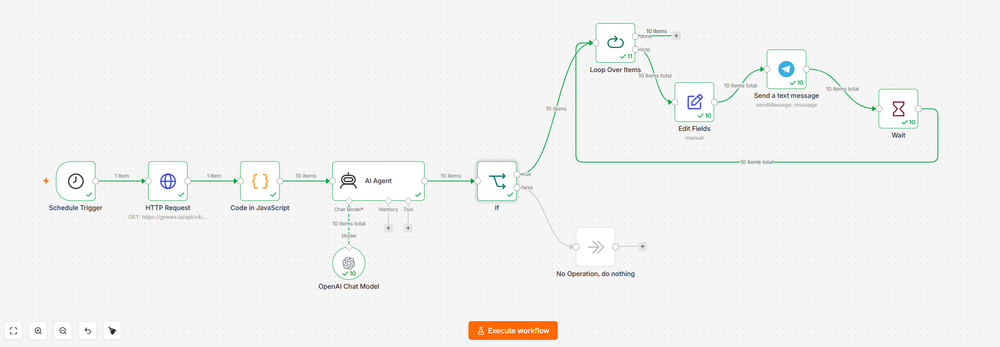

# 📰 News Automation (n8n Workflow)



An automated **n8n** workflow that fetches daily news, filters the important ones using an **AI Agent (GPT)**, and sends concise summaries — written in **Egyptian Colloquial Arabic** — directly to a **Telegram** chat.

---

## ✨ Features

-  **Scheduled** — runs automatically once a day (default: 11:00 PM).
-  **Fetches live news** from the [GNews API](https://gnews.io/).
-  **Cleans & normalizes** article data (title, description, source, URL, publish date).
-  **AI-powered filtering** — an AI Agent (OpenAI model) decides whether each article is relevant (AI, tech, startups, business, or Egypt's economy/news) and scores it.
-  **Auto-summarization** — important articles get summarized in clear, polite Egyptian Arabic, formatted for Telegram.
-  **Rate-limited sending** — loops through important articles one by one with a delay, avoiding Telegram flooding/rate limits.
-  **Filters out noise** — sports, celebrity gossip, entertainment, and unrelated news are automatically discarded.

---

## 🧩 Workflow Overview

```
Schedule Trigger
      │
      ▼
HTTP Request (GNews API)
      │
      ▼
Code (JavaScript) — extract & clean articles
      │
      ▼
AI Agent (OpenAI Chat Model) — evaluate importance + summarize
      │
      ▼
     If (important == true?)
      │yes                 │no
      ▼                     ▼
Loop Over Items      No Operation (skip)
      │
      ▼
Edit Fields — extract Telegram message
      │
      ▼
Send a text message (Telegram)
      │
      ▼
Wait — delay before next message
      │
      └──► back to Loop Over Items (next article)
```

---

## ⚙️ Requirements

| Service | Purpose | Link |
|---|---|---|
| **n8n** | Workflow automation platform (self-hosted or cloud) | https://n8n.io |
| **GNews API Key** | Fetching news articles | https://gnews.io |
| **OpenAI API Key** | Powering the AI Agent (filtering & summarizing) | https://platform.openai.com |
| **Telegram Bot Token** | Sending notifications | via [@BotFather](https://t.me/BotFather) |
| **Telegram Chat ID** | Destination chat for messages | see setup below |

---

## 🚀 Setup Instructions

### 1. Import the workflow
- In n8n, go to **Workflows → Import from File**.
- Select `News_Automation_httpRequest.json`.

### 2. Configure credentials
This workflow uses **3 sets of credentials** — you must create your own after importing (the original credential IDs belong to the workflow's original owner and won't work for you):

1. **GNews API Key** (`HTTP Request` node)
   - Credential type: *Query Auth* (or *Generic Credential → Query Auth*).
   - Get your key from [gnews.io](https://gnews.io) and set the query parameter name/value as required by GNews.

2. **OpenAI API Key** (`OpenAI Chat Model` node)
   - Credential type: *OpenAI API*.
   - Paste your API key from [platform.openai.com](https://platform.openai.com/api-keys).

3. **Telegram Bot** (`Send a text message` node)
   - Create a bot via [@BotFather](https://t.me/BotFather) and get the bot token.
   - Credential type: *Telegram API*.

### 3. Update the search query ⚠️
The `HTTP Request` node currently points to:
```
https://gnews.io/api/v4/search?q=example&lang=en&country=us&max=10
```
Replace `q=example` with real search terms relevant to your use case, e.g.:
```
q=AI OR technology OR startups OR "Egypt economy"
```

### 4. Set your Telegram Chat ID
In the `Send a text message` node, replace the `chatId` field with your own Telegram chat/channel ID.
> To get your chat ID, message [@userinfobot](https://t.me/userinfobot) on Telegram.

### 5. (Optional) Adjust the schedule
The `Schedule Trigger` node runs daily at **11 PM** by default — change `triggerAtHour` to your preferred time.

### 6. (Optional) Adjust the delay between messages
The `Wait` node currently uses n8n's default duration. If you expect many important articles per run, set an explicit delay (e.g., 2–3 seconds) to avoid Telegram rate limits.

### 7. Activate the workflow
Toggle the workflow to **Active** once all credentials and settings are configured.

---

## 🛠️ Customization

- **Change the AI's evaluation criteria** — edit the `systemMessage` in the `AI Agent` node to match different topics of interest.
- **Change summary language/tone** — the current prompt outputs Egyptian Colloquial Arabic; edit the system message to change language or tone.
- **Change the AI model** — swap the model in the `OpenAI Chat Model` node.
- **Add more news sources** — duplicate the `HTTP Request` node for other APIs (e.g., NewsAPI) and merge results before the `Code` node.

---

## 📌 Notes

- The GNews free tier has a limited number of daily requests — check your plan's limits.
- The AI Agent must return **strict JSON** (`important`, `score`, `reason`, `telegram_message`) — if you change the prompt, keep this structure intact since downstream nodes (`If`, `Edit Fields`) parse it directly.
- Sample pinned execution data may be included in the workflow file for testing purposes; remove it (`pinData`) before using in production if you don't want stale sample data bundled with the export.

---

## 📄 License

This project is provided as-is for personal/educational use. Feel free to fork and adapt it to your own needs.
