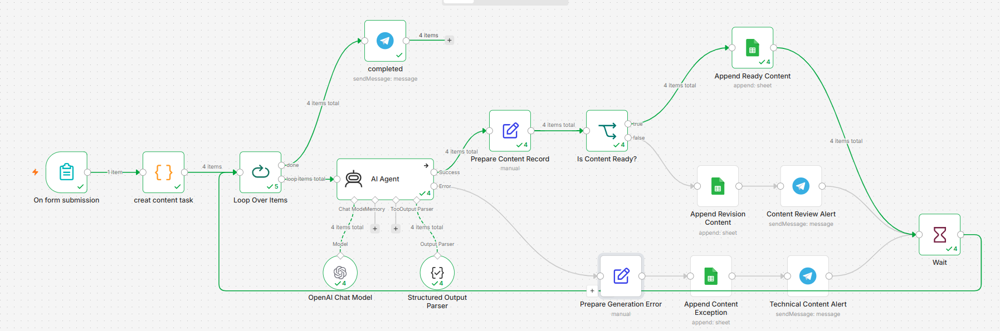

# AI Content Repurposing Workflow (n8n)

An n8n automation that takes **one source topic** and automatically repurposes it into **four channel-ready content pieces** (LinkedIn, Instagram, X/Twitter, and Newsletter) written in Arabic, with an AI-powered quality gate that routes each piece to either "ready to publish" or "needs human review."

Built as part of a hands-on n8n / AI automation portfolio.

---

## What it does

A marketer (or business owner) submits a single topic through a form. The workflow then:

1. Breaks that one topic into **4 channel-specific content tasks**, each with its own format and instructions.
2. Runs each task through an **AI Agent** that writes tailored, on-brand Arabic content for that channel — following strict anti-hallucination and brand-voice guardrails.
3. **Self-checks the output**: the AI evaluates whether the content is complete and trustworthy, or whether it needs a human's eyes before publishing.
4. Logs everything to **Google Sheets** (a content queue, split between "ready" and "needs review") and sends **Telegram notifications** for review requests, technical errors, and batch completion.

The result: instead of manually rewriting one idea four different ways, you submit it once and get four drafts plus a built-in quality check — with full traceability of what was generated, when, and why.

---

## Why this matters

This mirrors a real freelance/agency use case: content teams constantly need to adapt one core message across multiple platforms, and doing that manually is repetitive and inconsistent in tone. This workflow demonstrates:

- Multi-channel content generation from a single input
- AI-based **self-quality-control** (not just "generate and hope")
- Human-in-the-loop review for anything the AI isn't confident about
- Structured logging for auditability (every piece of content is traceable back to its source topic and generation decision)

---

## How it works (step by step)

```
Form Submission
      │
      ▼
Split topic into 4 channel tasks (Code node)
 → also runs a source-quality pre-check
      │
      ▼
Loop Over Items (one task at a time)
      │
      ▼
   AI Agent (GPT-5-mini + Structured Output Parser)
   → writes Arabic content for the channel
   → decides: quality_status = "ready" or "needs_review"
      │
   ┌──┴────────────────────┐
   │ Success                │ Error (API/model failure)
   ▼                        ▼
Prepare Content Record      Prepare Generation Error
   │                        │
   ▼                        ▼
Is Content Ready?           Append to "Content Exceptions" sheet
   │                        │
 ┌─┴──────────────┐         ▼
 ▼                ▼      Telegram: Technical Alert
Append to        Append to
"Ready" queue    "Needs Review" queue
 │                │
 │                ▼
 │           Telegram: Review Alert
 │                │
 └───────┬────────┘
         ▼
      Wait (rate-limit buffer)
         │
         ▼
   back to Loop Over Items
         │
   (repeats until all 4 channels are done)
         │
         ▼
 Telegram: "Batch completed" notification (sent once)
```

### 1. Form Trigger
Collects:
- **Source topic / short article** (required)
- **Brand voice** (optional — defaults to a professional/friendly tone if left blank)
- **Target audience** (optional)
- **Main goal** — dropdown: Educate / Generate leads / Build trust / Promote an offer (required)

### 2. Task splitting + source quality pre-check
A Code node turns the single submission into **4 parallel tasks** — one per channel (LinkedIn, Instagram, X, Newsletter) — each with channel-specific writing instructions. It also runs a lightweight pre-check on the source topic (word count / length) to flag topics that are too short or vague to generate reliable content from.

### 3. AI Agent (per channel)
Each task is processed individually through an AI Agent (OpenAI `gpt-5-mini`) with a system prompt that enforces:
- **Source-truth only** — no invented statistics, testimonials, or claims
- **Channel-appropriate tone and format** in Arabic
- **Hashtag rules** (only where relevant to the platform)
- **A quality gate**: the AI itself decides if the content is `ready` or `needs_review`, and must explain why

Output is enforced through a **Structured Output Parser** (JSON schema: `content`, `hashtags`, `cta`, `quality_status`, `qa_reason`), so downstream nodes always receive predictable, well-formed data.

### 4. Routing
- **AI/API errors** → logged to a "Content Exceptions" sheet + Telegram technical alert, without stopping the rest of the batch.
- **Ready content** → appended to the content queue as ready-to-publish.
- **Needs review** → appended to the content queue flagged for review + a Telegram alert with the draft and the reason it needs a human look.

### 5. Loop control
The workflow processes one channel at a time (via `Split In Batches`), with a short **Wait** step between iterations to stay well within API rate limits. Once all 4 channels are processed, a single **"batch completed"** Telegram message is sent (configured to execute once, not once per item).

---

## Tech stack / nodes used

| Category | Node(s) |
|---|---|
| Trigger | Form Trigger |
| Logic / data prep | Code, Set (Edit Fields), If, Split In Batches, Wait |
| AI | AI Agent (`@n8n/n8n-nodes-langchain`), OpenAI Chat Model (`gpt-5-mini`), Structured Output Parser |
| Storage | Google Sheets (append) |
| Notifications | Telegram |

---

## Setup

### 1. Credentials needed
- **OpenAI API** (for the AI Agent / Chat Model)
- **Telegram Bot API** (for notifications)
- **Google Sheets OAuth2** (for logging content)

### 2. Telegram chat ID
All Telegram nodes use a placeholder value — **`YOUR_TELEGRAM_ID`** — in place of the actual chat ID. Replace it with your own Telegram chat/user ID in each Telegram node (`completed`, `Content Review Alert`, `Technical Content Alert`) before running the workflow.

### 3. Google Sheet structure
Create a Google Sheet with two tabs matching the columns below (the workflow appends rows automatically — no formulas needed):

**Tab 1 — Content Queue** (used for both ready and needs-review content)
| Column | Description |
|---|---|
| `created_at` | Timestamp of generation |
| `content_id` | Unique ID per generated piece |
| `channel` | LinkedIn / Instagram / X / Newsletter |
| `audience` | Target audience from the form |
| `goal` | Main goal from the form |
| `content` | The generated Arabic content |
| `hashtags` | Suggested hashtags (if applicable) |
| `cta` | Suggested call-to-action |
| `quality_status` | `ready` or `needs_review` |
| `qa_reason` | Why it was marked ready / needs review |
| `source_topic` | Original topic submitted |
| `workflow_status` | `Queued for review` or `Blocked for revision` |

**Tab 2 — Content Exceptions** (technical/API failures only)
| Column | Description |
|---|---|
| `created_at` | Timestamp of the error |
| `content_id` | ID of the task that failed |
| `channel` | Which channel's generation failed |
| `exception_type` | Error category |
| `details` | Error message |
| `source_topic` | Original topic submitted |

### 4. Import and connect
1. Import the workflow JSON into n8n.
2. Attach your OpenAI, Telegram, and Google Sheets credentials to the respective nodes.
3. Update the Google Sheets nodes to point to your own spreadsheet/tabs.
4. Replace `YOUR_TELEGRAM_ID` in the Telegram nodes.
5. Activate the workflow and submit the form to test.

---

## Notes / possible improvements

- The source-quality pre-check uses a simple heuristic (word count and character length) — worth tuning further based on real submissions.
- A `Wait` step between loop iterations was added to keep the workflow comfortably within OpenAI's rate limits when scaling beyond 4 channels.
- Brand voice is used to guide the AI's writing but isn't currently persisted to the log sheet — could be added for extra traceability.

---

## License
Feel free to reuse or adapt this workflow for learning purposes.
