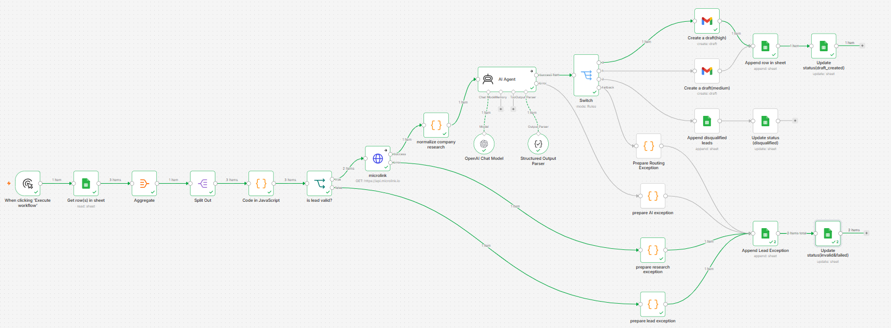

# B2B Lead Research & Outreach Automation

An n8n workflow that turns a raw list of B2B leads into a prioritized, research-backed outreach pipeline: it validates lead data, enriches each company from its public website, scores and drafts personalized outreach with an AI agent, and routes every outcome — successful, disqualified, or failed — to a fully auditable trail in Google Sheets.

## What This Solves

Manually researching leads before outreach is slow and inconsistent: someone has to open every website, judge whether the company is a realistic fit, write a tailored email, and keep track of who has already been contacted. This workflow automates the research and drafting steps while keeping a human firmly in control of what actually gets sent — no email leaves a draft state without review.

## Workflow Overview

The workflow runs each lead through four stages. At every stage, a failure is logged and the lead exits the pipeline rather than breaking the run for everyone else.

1. **Trigger and fetch** — a manual trigger pulls every row from the "Leads" sheet where `status` is `new`.
2. **Validate** — each lead is checked for required fields, a well-formed website URL, and a well-formed email.
   - Invalid leads are logged to the Lead Exceptions sheet and go no further.
3. **Enrich** — valid leads are looked up through the Microlink metadata API to pull public company data from their website.
   - A failed lookup is logged to the Lead Exceptions sheet.
   - A successful lookup is normalized and passed to the AI Agent.
4. **Score, draft, and route** — the AI Agent evaluates fit against the enriched data, assigns a priority, and drafts an outreach email.
   - An agent or parsing failure is logged to the Lead Exceptions sheet.
   - **High or medium priority** leads get a Gmail draft, a row in the Research Results sheet, and the source lead is marked `draft_created`.
   - **Low priority** leads get a row in the Disqualified Leads sheet with the model's reasoning, and the source lead is marked `disqualified`.
   - An unexpected priority value is logged to the Lead Exceptions sheet rather than silently dropped.

Every terminal outcome writes back to the source "Leads" sheet with a status (`draft_created`, `disqualified`, or the specific failure reason), so re-running the workflow only ever picks up genuinely new leads.

## Key Engineering Decisions

**Validation happens before any paid or external call.** Lead ID, company name, website URL, and email format are all checked in a single Code node before the workflow spends an API call on Microlink or a token on the AI Agent. Leads that fail validation are logged with the specific reason and never reach the research or scoring stages.

**Every external call is a designed failure point, not an afterthought.** The Microlink HTTP request and the AI Agent both use `continueErrorOutput` rather than letting a single bad response abort the whole execution. Each failure path funnels into its own Code node that captures a stage-specific reason (`research_failed`, `ai_failed`) before landing in a shared exception log.

**A single exception funnel, not four.** All four possible failure points (validation, enrichment, AI scoring, routing) converge on one "Append Lead Exception" node and one downstream status-update node, rather than duplicating Google Sheets writes at every branch. Each exception item already carries its own reason string, so the shared node needs no branch-specific logic — it logs whatever it receives and reuses that same reason to update the source lead's status.

**The AI Agent is constrained to evidence, not inference.** The system prompt explicitly forbids inventing company facts, technologies, or pain points, and requires the model to lower its own confidence and flag `needs_review` when the scraped metadata is thin. Output is enforced through a structured schema (priority, fit score, confidence, reasons, risk flags, a ready-to-review email) rather than free text, so downstream nodes can route on it reliably.

**Nothing sends automatically.** The AI Agent's system prompt explicitly prohibits sending email — every qualified lead becomes a Gmail draft, and a person decides whether it goes out. Priority still matters: high and medium fit leads get a draft; low fit leads are logged as disqualified with the model's own reasoning, so the decision is traceable even when no email is written.

**Idempotent by design.** The source sheet read is filtered to `status = "new"`, and every branch — success, disqualification, or failure — writes a terminal status back to that same row. Running the workflow twice on the same data does not create duplicate drafts or duplicate log entries; failed leads stay out of the queue until their status is manually reset, rather than being retried indefinitely.

## Tech Stack

- **n8n** — workflow orchestration
- **Google Sheets** — lead source, results, disqualifications, and exception log
- **Microlink API** — lightweight, no-auth company metadata enrichment from a website URL
- **OpenAI (GPT-5-mini) via LangChain Agent node** — lead scoring and outreach drafting, constrained with a structured output schema
- **Gmail API** — draft creation (no send permission required)

## Sheet Structure

The workflow reads from and writes to four tabs in one Google Sheet:

- **Leads** — the source list (`lead_id`, `company_name`, `website_url`, `contact_name`, `contact_email`, `industry`, `company_size`, `status`). This is the only sheet the workflow reads from; every other tab is write-only output.
- **Research Results** — one row per high/medium priority lead, including the AI's fit score, confidence, reasoning, and the drafted email content.
- **Disqualified Leads** — low priority leads with the model's stated reason, so a human can spot-check the model's judgment without digging through logs.
- **Lead Exceptions** — every failure, tagged with the stage it failed at (`validation`, `microlink_api`, `ai_scoring`, `routing`), the error message, and what action was taken.

## Setup

1. Import the workflow JSON into n8n.
2. Connect three credentials: Google Sheets OAuth2, OpenAI API, and Gmail OAuth2.
3. Create a Google Sheet with the four tabs described above and matching column headers, then point the workflow's Google Sheets nodes at your own spreadsheet ID.
4. Add leads to the "Leads" tab with `status` set to `new`.
5. Run the workflow manually, then review generated drafts in Gmail before sending.

## Known Limitations

- Failed leads are marked with their failure reason and excluded from future runs rather than retried automatically. If a failure was transient (for example, the Microlink API was temporarily down), the lead's status needs to be reset to `new` manually to reprocess it.
- Company enrichment relies on public metadata tags (title, description, publisher) from the target site; companies with minimal or non-standard metadata will produce lower-confidence research that the AI Agent is designed to flag, not silently compensate for.

## Possible Extensions

- A scheduled trigger instead of manual execution, with rate limiting for larger lead batches.
- A retry queue for transient failures (for example, Microlink timeouts) that reintroduces leads automatically after a delay instead of requiring a manual status reset.
- A lightweight review dashboard over the Research Results and Disqualified Leads sheets, so reviewing AI output does not require opening Google Sheets directly.
