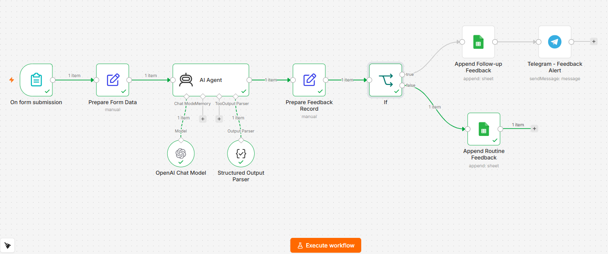

# Customer Feedback Escalation System

An n8n automation that collects customer feedback through a web form, uses an AI agent to analyze sentiment and urgency, and automatically routes each submission to the right channel — logging routine feedback for records and instantly alerting the support team about cases that need human follow-up.

## Overview

Manually reading through every piece of customer feedback to figure out what's urgent and what isn't doesn't scale. This workflow removes that bottleneck: every submission is analyzed by an AI agent that classifies sentiment, assigns a priority level, extracts topics, and decides whether a human needs to step in — all within seconds of the customer hitting submit.

## How It Works

1. **Feedback Collection** — A web form (`On form submission`) captures customer name, email, order ID, and free-text feedback.
2. **Data Preparation** — Submitted fields are normalized and timestamped before being sent to the AI agent.
3. **AI Analysis** — An AI Agent (OpenAI, with a Structured Output Parser) reads the feedback and returns:
   - `sentiment`: positive / neutral / negative
   - `priority`: low / medium / high
   - `needs_follow_up`: whether a human should review the case
   - `topics`: relevant categories (e.g. delivery, payment, product_quality)
   - `internal_summary`: a concise Arabic summary for the support team
   - `suggested_reply`: a safe, polite draft reply in Egyptian Arabic
4. **Routing** — An `If` node checks `needs_follow_up`:
   - **True →** the record is logged to a dedicated "Follow-up" sheet **and** a Telegram alert is sent to the support team immediately.
   - **False →** the record is logged to a "Routine" sheet for reporting, with no interruption to the team.

## Key Design Choices

- **Prompt injection guardrail**: The AI agent's system prompt explicitly instructs it to treat all incoming feedback as data only, never as instructions to execute — protecting against customers embedding manipulative text in their feedback.
- **Safe-by-default replies**: The agent is instructed never to promise refunds, compensation, or specific delivery dates, keeping suggested replies safe for support staff to send with minimal editing.
- **Separation of routine vs. urgent**: Splitting the two paths keeps the team's Telegram channel focused on cases that actually need attention, instead of every single submission.
- **HTML parse mode on Telegram alerts**: Since alert messages include free-form AI-generated text, HTML mode is used (with `&`, `<`, `>` escaped) rather than Markdown, which is far more likely to break on unpredictable AI output.

## Tech Stack

- **n8n** — workflow orchestration
- **OpenAI** — feedback classification and reply generation (via LangChain Agent node)
- **Google Sheets** — persistent logging (Follow-up + Routine feedback)
- **Telegram Bot API** — real-time alerts to the support team

## Setup

1. Import `Customer_Feedback_Escalation_System.json` into your n8n instance.
2. Configure credentials for:
   - OpenAI (or your preferred provider — swap the model in the `OpenAI Chat Model` node if needed)
   - Google Sheets OAuth2
   - Telegram Bot API
3. Replace the placeholder values with your own:
   - `YOUR_TELEGRAM_CHAT_ID` in the `Telegram - Feedback Alert` node
   - `YOUR_SHEET_ID` in both Google Sheets nodes
4. Make sure your Google Sheet has two tabs (or two sheets) with these columns:
   `received_at, customer_name, customer_email, order_id, feedback, sentiment, priority, needs_follow_up, topics, internal_summary, suggested_reply, status`
5. Activate the workflow and test it by submitting the form.

## Known Limitations / Roadmap

- The AI Agent's error output (e.g. malformed responses or API failures) isn't currently routed anywhere — a planned improvement is to log failed analyses to a dedicated "Errors" sheet, with a Telegram alert for repeated failures.
- No confidence threshold on the AI classification yet — all outputs are trusted as-is.
- Sticky notes documenting each stage directly inside the n8n canvas are planned to make the workflow easier to follow without needing this README open side-by-side.

## Example Flow

```
Form Submission
      │
      ▼
Prepare Form Data
      │
      ▼
AI Agent (sentiment, priority, needs_follow_up, topics, summary, reply)
      │
      ▼
Prepare Feedback Record
      │
      ▼
     If (needs_follow_up?)
    ┌──────┴──────┐
   Yes            No
    │              │
    ▼              ▼
Log to Sheet   Log to Sheet
(Follow-up)    (Routine)
    │
    ▼
Telegram Alert
```
