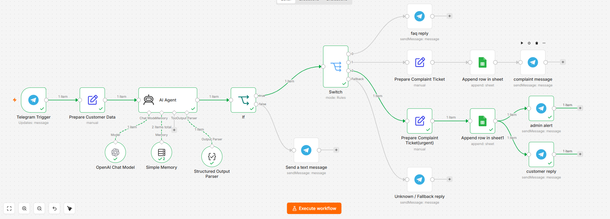

# Customer Support Triage — AI-Powered n8n Workflow


An automated customer support triage system built with **n8n**, **OpenAI**, and **Google Sheets**, integrated with **Telegram** as the customer-facing channel. The workflow classifies incoming customer messages in real time, replies to the customer in natural Egyptian Arabic, logs an internal record for the support team, and escalates urgent cases to a human agent automatically.

## Problem it solves

Small businesses running customer support over Telegram usually rely on a human reading every single message to decide: *Is this a simple question? A complaint? Something urgent?* This doesn't scale, and response times suffer. This workflow automates that first-line triage step — the routine classification and response work — so human agents can focus on the cases that actually need them.

## How it works

```
Telegram message
      │
      ▼
Prepare Customer Data (generate ticket_id, timestamp)
      │
      ▼
AI Agent (GPT-5 mini + Structured Output Parser + Memory)
      │  → classifies: faq / complaint / urgent / unknown
      │  → returns: category, confidence, urgency, needs_human,
      │              customer_reply, internal_summary, clarification_question
      ▼
Confidence Check (≥ 0.7 ?)
      │
   ┌──┴──────────────────────────┐
   ▼                              ▼
 Route by Category            Ask for clarification
 (Switch)                     (low-confidence reply)
   │
   ├── faq        → reply directly to customer
   ├── complaint   → log ticket to Google Sheets → reply with ticket number
   ├── urgent      → log ticket → alert admin + reply to customer (escalated)
   └── fallback    → category didn't match any known type → ask customer to clarify
```

## Key features

- **AI-based classification** into `faq`, `complaint`, `urgent`, or `unknown`, using a strict JSON schema (Structured Output Parser) — the model cannot return malformed or unexpected fields.
- **Confidence gating** — replies below a 0.7 confidence threshold are routed to a clarification step instead of a potentially wrong response.
- **Dual-output design** — internal records (category, summary) are kept in English for the support team, while customer-facing replies are in natural Egyptian Colloquial Arabic. Internal metadata (category, confidence score) is never exposed to the customer.
- **Automatic escalation** — urgent cases immediately notify an admin via Telegram in addition to replying to the customer, so nothing waits unnoticed.
- **Conversation memory** — a per-customer session buffer (last 10 messages) so the AI Agent has context across a conversation, not just a single message.
- **Fallback routing** — any message that doesn't cleanly match a known category is caught by a dedicated fallback branch instead of being silently dropped.
- **Ticket logging** — complaint and urgent cases are appended as structured rows to Google Sheets, acting as a lightweight internal ticketing system with a unique `ticket_id` per case.

## Tech stack

| Component | Tool |
|---|---|
| Automation platform | [n8n](https://n8n.io) |
| AI model | OpenAI GPT-5 mini (via `@n8n/n8n-nodes-langchain`) |
| Output validation | LangChain Structured Output Parser (JSON schema) |
| Conversation memory | LangChain Buffer Window Memory |
| Customer channel | Telegram Bot API |
| Internal logging | Google Sheets |

## Workflow breakdown

- **Telegram Trigger** — entry point; listens for new customer messages.
- **Prepare Customer Data** — normalizes incoming data and generates a unique `ticket_id` and timestamp for every message.
- **AI Agent** — the core reasoning step. Classifies the message, decides urgency and escalation, and drafts the customer-facing reply, constrained by a strict output schema.
- **If (Confidence Gate)** — filters out low-confidence classifications before they reach a customer, reducing the risk of an incorrect automated response.
- **Switch (Router)** — routes each case to its correct path based on category, with a fallback output for anything unmatched.
- **Prepare Ticket (Set) → Google Sheets** — builds and logs a structured ticket record for complaint/urgent cases.
- **Telegram reply nodes** — send the appropriate customer-facing message per branch (FAQ answer, complaint acknowledgment + ticket number, urgent escalation notice, or clarification request), and alert an admin for urgent cases.

## Setup

1. Import `Customer_Support_Triage.json` into your n8n instance.
2. Connect your own credentials for: Telegram Bot API, OpenAI API, and Google Sheets OAuth2.
3. Create a Google Sheet with columns: `ticket_id, created_at, customer_chat_id, category, urgency, customer_message, internal_summary, status`, and point the two Google Sheets nodes to it.
4. Activate the workflow.

## Known limitations / future improvements

- `faq` classifications are replied to directly but are not currently logged to Google Sheets — only `complaint` and `urgent` are. Adding FAQ logging would give full visibility into all support volume, not just escalated cases.
- No explicit error handling around the AI Agent call yet — a malformed model response or API failure currently stops the run rather than falling back to a generic apology message.
- Non-text messages (photos, voice notes, stickers) aren't explicitly handled; a validation step before the AI Agent would make this more robust.
- Currently single-channel (Telegram). The same architecture could extend to WhatsApp or a website widget with minimal changes to the trigger and reply nodes.

## Example

**Customer:** "عايزة أعرف سياسة الاسترجاع"
**Bot classifies as:** `faq` → replies directly with the policy in friendly Egyptian Arabic.

**Customer:** "دفعت مرتين بالغلط ومحتاجة استرجاع فلوسي دلوقتي"
**Bot classifies as:** `urgent` → logs a ticket, alerts the admin instantly, and confirms escalation to the customer with a ticket number.

---

*Built as part of a hands-on n8n learning project focused on practical AI + automation patterns: structured LLM output, confidence-based routing, and multi-channel escalation logic.*
