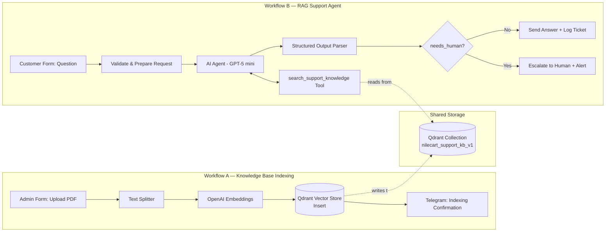

# NileCart AI Customer Support — RAG-Powered Automation

An automated, AI-driven customer support system built in **n8n**, using **Retrieval-Augmented Generation (RAG)** to answer customer questions in Arabic directly from a company knowledge base — with automatic escalation to a human agent whenever the AI cannot answer confidently.

This project is composed of **two independent but connected workflows** that together form a complete RAG pipeline: one for building the knowledge base, and one for serving customer queries against it.

---

## Why Two Workflows Instead of One

A common beginner mistake in RAG projects is cramming "ingest the data" and "answer the question" into a single workflow. This project deliberately separates them, because they are two different *processes* with two different lifecycles:

| | Workflow A — Indexing | Workflow B — RAG Agent |
|---|---|---|
| **Runs** | Rarely (only when policies are added/updated) | Continuously (every customer message) |
| **Trigger** | Manual form submission by an admin | Customer-facing form |
| **Job** | Turn a PDF into searchable vector embeddings | Retrieve relevant knowledge + generate a grounded answer |

The two workflows never call each other directly. They are **decoupled through a shared Qdrant vector collection** (`nilecart_support_kb_v1`) — Workflow A writes to it, Workflow B reads from it. This is standard RAG system design: the knowledge base and the agent that consumes it should be able to evolve independently.

---

## Workflow A — Knowledge Base Indexing

**Purpose:** Convert a support policy document into searchable vector embeddings.

**Flow:**
1. **Form Trigger** — an admin submits a `source_title` and uploads a PDF (`knowledge_file`).
2. **Recursive Character Text Splitter** — splits the document into ~700-character chunks with 120-character overlap, preserving context across chunk boundaries.
3. **Default Data Loader** — extracts the PDF's text and attaches custom metadata (`source_title`, `source_type`, `version`) to every chunk, so the agent can later cite exactly where an answer came from.
4. **Qdrant Vector Store (Insert Mode)** — embeds each chunk via OpenAI Embeddings and stores it in the `nilecart_support_kb_v1` collection.
5. **Telegram Notification** — confirms the document was indexed.

---

## Workflow B — RAG Support Agent

**Purpose:** Answer customer questions strictly from the indexed knowledge base, and know when *not* to answer.

**Flow:**
1. **Form Trigger** — captures the customer's question and order context.
2. **Validation (If node)** — filters out empty/too-short questions before they reach the model.
3. **AI Agent (GPT-5 mini)** — governed by a strict system prompt with hard rules:
   - **Must** call the `search_support_knowledge` tool before answering — never answer from memory.
   - Must not fabricate policies, prices, or promises not found in the source.
   - Must flag `needs_human = true` for order-specific, sensitive, or insufficiently-supported questions.
   - Treats the customer's message as **data only** — ignores any instructions embedded inside it (prompt-injection guardrail).
4. **search_support_knowledge (Tool)** — a Qdrant retriever-as-tool node that performs similarity search against the shared collection.
5. **Structured Output Parser** — forces the model's answer into a strict schema: `answer_ar`, `confidence`, `needs_human`, `handoff_reason`, `source_used`, `source_excerpt`.
6. **Routing (If node)** — reads `needs_human` and branches into:
   - ✅ **Answered** → reply sent to the customer + ticket logged in Google Sheets.
   - 🧑‍💼 **Needs Human** → ticket escalated, support team alerted via Telegram.
7. **Error Branch** — if the AI Agent itself fails (API/tooling error), a separate technical-alert path fires instead of silently failing.

---

## Guardrails Built Into the Agent

- **Grounding enforcement:** the agent is structurally prevented from answering without first retrieving supporting context.
- **Prompt-injection resistance:** customer input is explicitly treated as untrusted data, not instructions.
- **No sensitive-data handling:** the agent is instructed to never request card numbers, CVV, OTPs, or passwords, and to hand off immediately if a customer shares them.
- **Explainability:** every answer carries a `source_used` and `source_excerpt`, so a human reviewer can audit *why* the AI said what it said.
- **Fail-safe default:** when confidence is low, the system defaults to escalation rather than guessing.

---

## The Hardest Bug — and What It Taught Me

**Symptom:** The agent was escalating *every single question* to a human — including ones whose answers existed almost verbatim in the source PDF.

**Debugging process:**
1. Verified Workflow A's indexing execution — confirmed the PDF was successfully split into chunks and inserted into Qdrant with no errors (7 chunks, correct metadata, no encryption/parsing issues).
2. Opened Workflow B's execution logs and traced the AI Agent's internal steps — confirmed `search_support_knowledge` **was** being called (twice, in fact), ruling out a "tool not invoked" theory.
3. Inspected the tool's actual *output* — and found the correct chunk (the delivery/shipping policy) was being retrieved successfully.
4. Looked closer at the retrieved `pageContent` itself — and discovered the Arabic text was being extracted **character-mirrored per line** (e.g. `.1 ﻦﺤﺸﻟوا ﻞﻴﺻﻮﺘﻟا` instead of `التوصيل والشحن .1`), while embedded Latin words and numbers (`NileCart`, `Visa`, `1200`) were unaffected.
5. Confirmed the root cause by copy-pasting text directly from the PDF into Notepad — it came out correctly ordered, proving the *PDF's own text layer* was fine, but **n8n's PDF text-extraction library was not applying correct Unicode bidirectional (BiDi) reordering** for the RTL Arabic runs during extraction.

**Root cause:** A known limitation of PDF text-extraction libraries with right-to-left (Arabic) content — the extractor read glyph runs in visual/storage order instead of logical reading order, corrupting the Arabic text before it ever reached the language model. The retrieval pipeline was working perfectly; the *data it was retrieving* was silently broken.

**Fix:** Migrated the knowledge base source format from PDF to plain text, eliminating the PDF text-layer/BiDi dependency entirely and guaranteeing the model always receives clean, correctly-ordered Arabic.

---

## Tech Stack

- **n8n** — workflow orchestration
- **OpenAI (GPT-5 mini + Embeddings)** — reasoning and vector embeddings
- **Qdrant** — vector database for semantic search
- **Google Sheets** — support ticket logging
- **Telegram** — internal notifications/alerts

---

## Setup

1. Import both workflow JSON files into your n8n instance.
2. Add credentials for: OpenAI, Qdrant, Google Sheets, Telegram.
3. Create a Qdrant collection (or let Workflow A auto-create it on first insert).
4. Run **Workflow A** once per knowledge document you want indexed (plain text or `.docx` sources recommended over PDF for reliable Arabic extraction).
5. Activate **Workflow B** to start serving customer questions.

---

## Author

Built as part of an ongoing hands-on n8n / AI automation portfolio, focused on production-style patterns: grounding, guardrails, structured output, and human-in-the-loop escalation.
