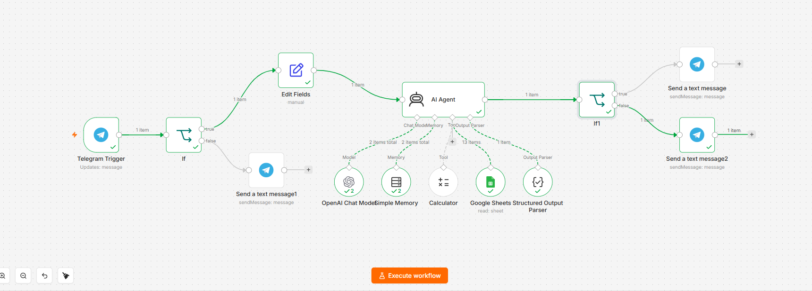

# Sales Data Analyst (Telegram + n8n + AI Agent)



An n8n workflow that connects a Telegram bot to an AI Agent capable of answering natural-language questions about sales data stored in Google Sheets. Users interact in Arabic; the agent queries the underlying English-language spreadsheet, performs calculations when needed, and replies in polite Egyptian Colloquial Arabic.

## Overview

The workflow receives a message from a Telegram user, validates that it contains real text (rejecting empty messages, stickers, or images), and passes the question to an AI Agent. The agent is equipped with tools to read the sales spreadsheet and perform accurate calculations, and it always returns a structured response indicating whether the query succeeded, was ambiguous, or referenced data that does not exist. Based on that status, the workflow sends the appropriate reply back to the user on Telegram.

## Workflow Architecture

```
Telegram Trigger
      |
      v
If (message contains valid text?)
   |yes                    |no
   v                        v
Edit Fields          Send text message (ask user to send text)
(chat_id, user_question)
   |
   v
AI Agent
   |-- OpenAI Chat Model (language model)
   |-- Simple Memory (per-chat conversation memory)
   |-- Google Sheets Tool (read sales data)
   |-- Calculator Tool (accurate math)
   |-- Structured Output Parser (status + telegram_message)
   |
   v
If1 (status == SUCCESS?)
   |yes                    |no
   v                        v
Send answer          Send clarification / not found message
```

## Features

- Natural-language querying of sales data through a Telegram chat interface.
- Bilingual handling: user questions in Arabic are mapped to the English column values in the spreadsheet, and all replies are returned in Egyptian Colloquial Arabic.
- Dedicated Calculator tool ensures totals, averages, and growth rates are computed accurately rather than estimated by the language model.
- Structured output (SUCCESS / AMBIGUOUS / NOT_FOUND) drives conditional replies, so the user always receives an appropriate response instead of a generic answer.
- Per-user conversation memory, keyed by Telegram chat ID, so follow-up questions retain context.
- Input validation that filters out empty messages, emoji-only messages, and non-text content (photos, stickers, voice notes) before they reach the AI Agent.

## Requirements

| Service | Purpose |
|---|---|
| n8n | Workflow automation platform (self-hosted or cloud) |
| Telegram Bot Token | Receiving and sending messages |
| OpenAI API Key | Powering the AI Agent |
| Google Sheets (OAuth2) | Source of sales data, read access |

## Setup Instructions

### 1. Import the workflow
In n8n, go to Workflows, then Import from File, and select the workflow JSON.

### 2. Configure credentials
Credentials are not included in the export and must be created after import:

1. Telegram Bot: create a bot via BotFather on Telegram, then add the token as a Telegram API credential in n8n (used by the Telegram Trigger and the Telegram reply nodes).
2. OpenAI API Key: add your key as an OpenAI API credential (used by the OpenAI Chat Model node).
3. Google Sheets: connect your Google account via OAuth2 (used by the Google Sheets Tool node).

### 3. Point the Google Sheets Tool at your own spreadsheet
Update the Document ID and Sheet Name in the Google Sheets node to reference your own sales spreadsheet. The expected columns are:

- date (YYYY-MM-DD)
- city
- product
- category
- quantity
- unit-price
- sales_rep

If your column names differ, update the tool description in the Google Sheets node to match, so the agent maps Arabic search terms correctly.

### 4. Restrict spreadsheet access to read-only
The agent should only read data, never modify it. Open the spreadsheet in Google Sheets, click Share, and set the account connected to n8n as Viewer rather than Editor. This enforces read-only access at the Google level regardless of what the agent attempts.

### 5. Review the Structured Output Parser schema
The parser enforces a fixed response shape:

```json
{
  "type": "object",
  "properties": {
    "status": { "type": "string", "enum": ["SUCCESS", "AMBIGUOUS", "NOT_FOUND"] },
    "telegram_message": { "type": "string" }
  },
  "required": ["status", "telegram_message"]
}
```

This keeps the downstream If node reliable regardless of how the model phrases its answer.

### 6. Activate the workflow
Toggle the workflow to Active once all credentials and the spreadsheet reference are configured.

## Customization

- Change the agent's tone, boundaries, or language by editing the systemMessage in the AI Agent node.
- Add more statuses (for example, PARTIAL) by extending both the systemMessage instructions and the Structured Output Parser schema, then adding a corresponding branch after If1.
- Swap the language model by changing the model selected in the OpenAI Chat Model node.

## Notes

- The AI Agent must always return the exact JSON structure defined in the Structured Output Parser; changing the response format requires updating both the systemMessage and the schema together.
- Retry on Fail is enabled on the AI Agent node to handle transient API errors (rate limits, brief network issues).
- No credentials or spreadsheet data are included in this repository; each user must connect their own.

## License

This project is provided as-is for personal and educational use. Feel free to fork and adapt it to your own needs.
