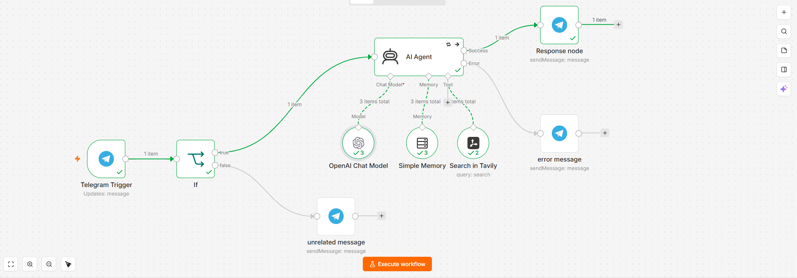

# Tavily Search Agent — AI-Powered Telegram Research Bot



An AI Agent, accessible through Telegram, that answers user questions by searching the live web with **Tavily** — instead of relying only on the model's static knowledge.
## The Problem It Solves

Static AI chatbots can't answer questions about current events, recent news, or anything beyond their training data. This agent solves that by giving the AI a **real-time web search tool**, so it always has access to fresh, accurate information — and knows *when* it actually needs to search versus when it can just respond directly (e.g. a simple greeting).

## How It Works

```
Telegram Trigger
      │
      ▼
   If Node  ──(invalid input)──▶ "Please send a text message" reply
      │
 (valid text)
      │
      ▼
   AI Agent ──(tool call)──▶ Tavily Web Search
      │
      ├──(success)──▶ Reply formatted in Markdown
      │
      └──(failure)──▶ Graceful fallback message
```

1. **Telegram Trigger** — listens for incoming messages.
2. **If Node (input validation)** — checks that the message actually contains meaningful text. Messages that are empty, stickers, images, or *emoji-only* (e.g. "❤️❤️❤️") are filtered out and redirected to a clarification message, while normal text — even text that includes emojis — passes through correctly.
3. **AI Agent** — powered by GPT, decides whether the question needs a live web search or can be answered directly (e.g. casual conversation), using a system prompt that defines its role, tone , and boundaries (e.g. no medical/legal advice).
4. **Tavily Tool** — called by the agent on demand to fetch real-time search results.
5. **Memory (Buffer Window)** — keeps track of the last messages per user, so the conversation has context.
6. **Telegram Reply** — sends the final answer back, formatted with Markdown for readability.

## Version History

- **[workflow-v1.json](./workflow-v1.json)** — Initial version. During testing, I found and fixed a bug where the Telegram Chat ID was hardcoded instead of being read dynamically, meaning the bot would only ever reply to one user regardless of who messaged it.
- **[workflow-v2.json](./workflow-v2.json)** — Fixed version with dynamic Chat ID, input validation (filters empty/emoji-only messages and stickers), retry logic, and error fallback messages. **This is the version to use.**

## The 3 Reliability Layers

Every AI Agent workflow I build follows the same three standards:

**✅ Error Handling**
- The AI Agent has `retryOnFail` enabled and a dedicated error output — if it fails, the user gets a clear fallback message instead of the workflow silently breaking.
- The Tavily search tool fails gracefully instead of crashing the whole flow.

**✅ Multiple Scenarios**
- Input is validated *before* it reaches the AI Agent: empty messages, stickers/images (no `text` field), and emoji-only messages are all detected and routed differently from real text questions.
- Inside the agent, casual conversation is handled differently from research questions — it doesn't call the search tool unnecessarily.

**✅ Clean Output Formats**
- Responses are sent with `parse_mode: Markdown` so formatted answers render properly instead of as raw text.
- The system prompt enforces spaced, readable formatting instead of dense paragraphs.

## Tech Stack

- **n8n** — workflow orchestration
- **OpenAI (GPT)** — the agent's reasoning model
- **Tavily API** — real-time web search tool
- **Telegram Bot API** — user interface / trigger

## Notes

- Credentials in the exported workflow file are reference IDs only (no live API keys are included).
- This project is part of a larger portfolio — see the [main README](../README.md) for more.
